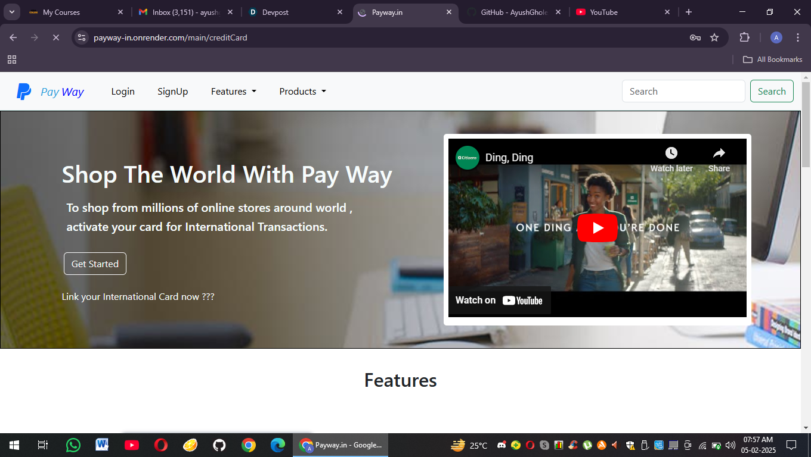

<b>Description :</b> 

PayWay.in is a modern electronic banking system built using the MERN stack (MongoDB, Express.js, React, Node.js) with an MVC architecture, designed for seamless, secure, and user-friendly digital transactions. It offers real-time balance updates, secure JWT-based authentication, and a responsive UI powered by Bootstrap CDN. With features like fund transfers, payment processing, and AI-driven financial insights (future scope), PayWay aims to revolutionize digital banking. The system ensures high security with Bcrypt.js password hashing, optimized API performance, and scalability with deployments on Vercel (frontend), Render (backend), and MongoDB Atlas (database). Future enhancements include mobile app development, multi-currency and crypto support, automated bill payments, and advanced security features like 2FA and fraud detection, making PayWay a next-gen banking solution. 🚀
 

<b>Front View : </b> 

<b>User DashBoard : </b>

 
<b>Building Of The Website : </b>
Building PayWay.in follows a structured approach using the MERN stack (MongoDB, Express.js, React, Node.js) with the MVC (Model-View-Controller) architecture for efficient development. The backend (Node.js & Express.js) handles authentication, transactions, and user management, with MongoDB storing user and transaction data through Mongoose models. The controllers manage API requests, while routes handle client-server communication. The frontend (React.js with Bootstrap CDN) ensures a responsive UI with reusable components, styled using Bootstrap without local dependencies. Axios facilitates API calls, and CORS policies are configured for smooth frontend-backend interaction. JWT authentication & Bcrypt.js ensure secure login, while MongoDB Atlas, Render, and Vercel handle deployment for a scalable infrastructure. This approach ensures security, performance, and a seamless banking experience for users. 🚀

 
<b>Product Page : </b>

 
<b>Send Money Page : </b>

 
<b> What’s Next?</b>  
Mobile App Development (React Native)  
Automated Bill Payments & Investment Features  
Advanced Security (2FA, Fraud Detection, Biometric Login)  

 
<b>Links For The Projects : </b> 
Deployed Link : <b>"https://payway-in.onrender.com/main"</b> 
You Tube : <b>"https://youtu.be/XHy9QOcM2gA"</b> 
